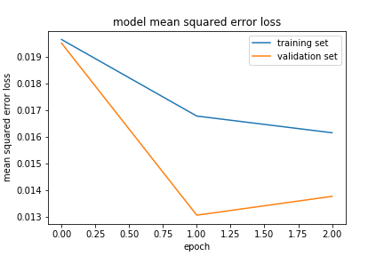

# **Behavioral Cloning** 

---

**Behavioral Cloning Project**

The goals / steps of this project are the following:
* Use the simulator to collect data on good driving behavior
* Build, a convolution neural network in Keras that predicts steering angles from images
* Train and validate the model with a training and validation set
* Test that the model successfully drives around track one without leaving the road
* Summarize the results with a written report


## Rubric Points
### Here I will consider the [rubric points](https://review.udacity.com/#!/rubrics/432/view) individually and describe how I addressed each point in my implementation.  

---
### Files Submitted & Code Quality

#### 1. The submission includes all required files and can be used to run the simulator in autonomous mode

My project includes the following files:
* model.py containing the script to create and train the model
* drive.py for driving the car in autonomous mode
* model.h5 containing a trained convolution neural network 
* video.mp4 recording of the vehicle driving autonomously around the track. It includes one full lap around the track
* writeup_report.md summarizing the results

#### 2. Submission includes functional code
Using the Udacity provided simulator and my drive.py file, the car can be driven autonomously around the track by executing 
```sh
python drive.py model.h5
```

#### 3. Submission code is usable and readable

The model.py file contains the code for training and saving the convolution neural network. The file shows the pipeline I used for training and validating the model, and it contains comments to explain how the code works.

### Model Architecture and Training Strategy

#### 1. An appropriate model architecture has been employed

I used the Nvidia End-to-End model Architecture, which is specifically designed to minimize the mean-squared error between the steering command and command of the human drivers.

The model architecture is as follows, which consists of 9 layers, including a normalization layer, 5 convolutional layers, and 3 fully connected layers. 


#### 2. Attempts to reduce overfitting in the model

The model contains two dropout layers in order to reduce overfitting. 

The model was trained and validated on different data sets to ensure that the model was not overfitting. The model was tested by running it through the simulator and ensuring that the vehicle could stay on the track.

#### 3. Model parameter tuning

The model used an adam optimizer, so the learning rate was not tuned manually.

#### 4. Appropriate training data

Training data was chosen to keep the vehicle driving on the road. I used a combination of center lane driving, recovering from the left and right sides of the road. I have also tried to drive the car in the opposite direction. Furthermore, I drove the car for two laps instead of just one. 

For details about how I created the training data, see the next section. 

### Model Architecture and Training Strategy

#### 1. Solution Design Approach

The overall strategy for deriving a model architecture was to first use a suggested model architecture and then, if necessary, modified it.

My first step was to use a convolution neural network model similar to the "Nvidia end-to-end architecture." I thought this model might be appropriate because Nvidia architecture is specified designed for this situation.

In order to gauge how well the model was working, I split my image and steering angle data into a training(80%) and validation set(20%).
I found that my first model had a low mean squared error on the training set but a high mean squared error on the validation set. This implied that the model was overfitting. 

To combat the overfitting, I modified the model by adding two dropout layers. Then I tuning the dropout prob. First I used dropout(0.5), but the loss value is larger than before. So finally I change it to 0.15, it looks better.  

The final step was to run the simulator to see how well the car was driving around track one. There were a few spots where the vehicle fell off the track. At the very begnning, the spots appear usually at the sharp curves and stone road. In order to improve the driving behavior in these cases, I collect more data in these spots. I first drive the vehicle along the curves and then return to the middle of the road. 

At the end of the process, the vehicle is able to drive autonomously around the track without leaving the road.

#### 2. Final Model Architecture

The final model architecture is build based on the Nvidia model architecture. I first added two layers for data pre-processing, namely lamaba layers for data normalization and standardization and cropping2d layers to suppress the interference beyond the road.In addition, I added also two dropout layers to prevent overfitting. 

Here is the example of cropping.


Here is a visualization of the architecture.


#### 3. Creation of the Training Set & Training Process

#####  Collection more Data

To capture good driving behavior, I used the following strategies:
- Recorded two laps using the center lane driving
- Driving vehicle in counter-clockwise
- recorded the vehicle recovering from the left side and right sides of the road back to center so that the vehicle would learn how to come back from sides
- recorded some special spots, for instance, on sharp curves

##### image Augmentation
- Using flipped images
To augment the data set, I flipped images and angles thinking that this would double the data. Here is an example for flipping:


- Using all 3 cameras 
To using the multi-cameras, a correction of steering angle for left and right cameras have to be added. The trick is： adding the correction angle (0.2) to the left and subtract the angle from the right one. The graph below shows the difference between 3 cameras.


##### Data preprocessing
After the collection process, I then preprocessed this data with the layer Lamba and cropping.
I finally randomly shuffled the data set and put 20% of the data into a validation set. 

##### Paramtar tuning

I used this training data for training the model. The validation set helped determine if the model was over or under fitting. I first set the epochs 3. I found that the validation loss is increasing, I then reduce the epochs. The ideal number of epochs was 3. I used an adam optimizer so that manually training the learning rate wasn't necessary.

Finally, the result is shown in the picture below.

